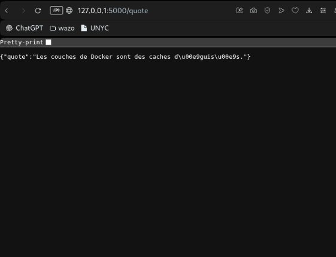
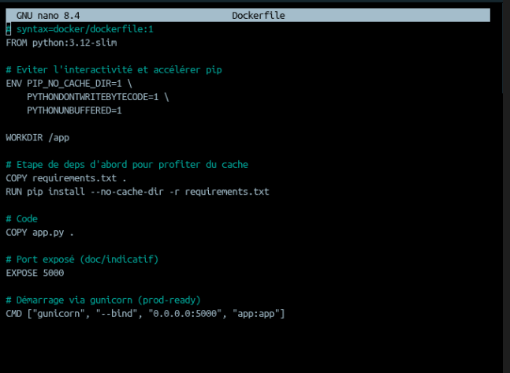
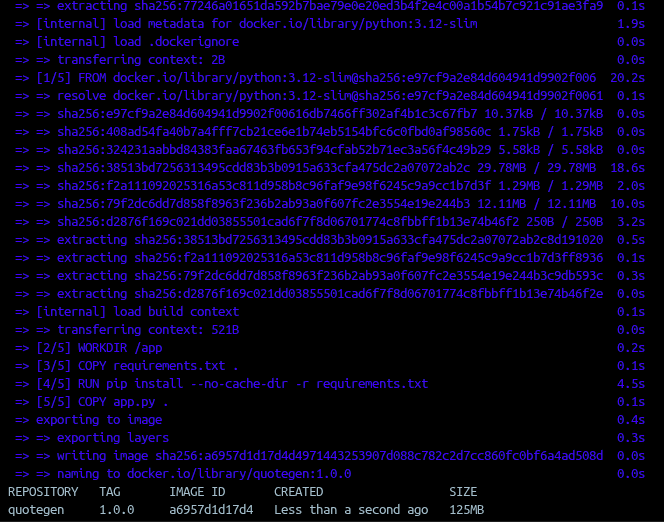
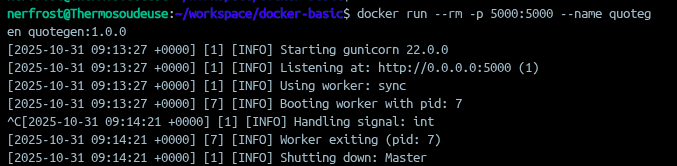
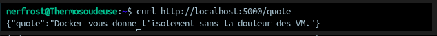
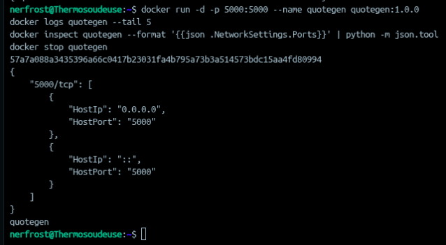
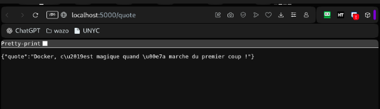
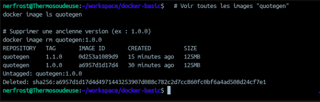
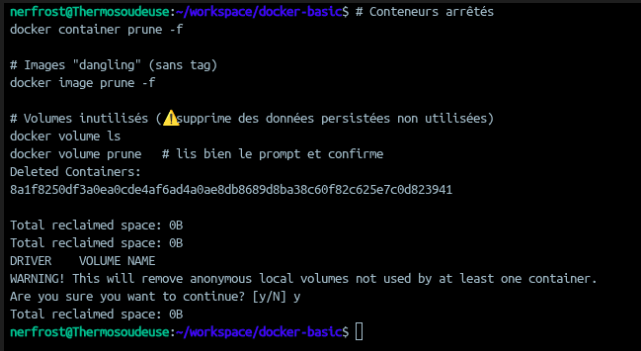

## Etape 0

## ETAPE 1

- docker version :
	- nerfrost@Thermosoudeuse:~/workspace/docker-basic$ docker version
		Client: Docker Engine - Community
		 Version:           28.5.1
		 API version:       1.51
		 Go version:        go1.24.8
		 Git commit:        e180ab8
		 Built:             Wed Oct  8 12:17:24 2025
		 OS/Arch:           linux/amd64
		 Context:           desktop-linux
		
		Server: Docker Desktop 4.49.0 (208700)
		 Engine:
		  Version:          28.5.1
		  API version:      1.51 (minimum version 1.24)
		  Go version:       go1.24.8
		  Git commit:       f8215cc
		  Built:            Wed Oct  8 12:17:24 2025
		  OS/Arch:          linux/amd64
		  Experimental:     false
		 containerd:
		  Version:          1.7.27
		  GitCommit:        05044ec0a9a75232cad458027ca83437aae3f4da
		 runc:
		  Version:          1.2.5
		  GitCommit:        v1.2.5-0-g59923ef
		 docker-init:
		  Version:          0.19.0
		  GitCommit:        de40ad0

- Docker Info :
	- nerfrost@Thermosoudeuse:~/workspace/docker-basic$ docker info
		Client: Docker Engine - Community
		 Version:    28.5.1
		 Context:    desktop-linux
		 Debug Mode: false
		 Plugins:
		  ai: Docker AI Agent - Ask Gordon (Docker Inc.)
		    Version:  v1.9.11
		    Path:     /home/nerfrost/.docker/cli-plugins/docker-ai
		  buildx: Docker Buildx (Docker Inc.)
		    Version:  v0.29.1-desktop.1
		    Path:     /home/nerfrost/.docker/cli-plugins/docker-buildx
		  compose: Docker Compose (Docker Inc.)
		    Version:  v2.40.3-desktop.1
		    Path:     /home/nerfrost/.docker/cli-plugins/docker-compose
		  debug: Get a shell into any image or container (Docker Inc.)
		    Version:  0.0.45
		    Path:     /home/nerfrost/.docker/cli-plugins/docker-debug
		  desktop: Docker Desktop commands (Docker Inc.)
		    Version:  v0.2.0
		    Path:     /home/nerfrost/.docker/cli-plugins/docker-desktop
		  extension: Manages Docker extensions (Docker Inc.)
		    Version:  v0.2.31
		    Path:     /home/nerfrost/.docker/cli-plugins/docker-extension
		  init: Creates Docker-related starter files for your project (Docker Inc.)
		    Version:  v1.4.0
		    Path:     /home/nerfrost/.docker/cli-plugins/docker-init
		  mcp: Docker MCP Plugin (Docker Inc.)
		    Version:  v0.24.0
		    Path:     /home/nerfrost/.docker/cli-plugins/docker-mcp
		  offload: Docker Offload (Docker Inc.)
		    Version:  v0.5.1
		    Path:     /home/nerfrost/.docker/cli-plugins/docker-offload
		  sandbox: Docker Sandbox (Docker Inc.)
		    Version:  v0.3.1
		    Path:     /home/nerfrost/.docker/cli-plugins/docker-sandbox
		  sbom: View the packaged-based Software Bill Of Materials (SBOM) for an image (Anchore Inc.)
		    Version:  0.6.0
		    Path:     /home/nerfrost/.docker/cli-plugins/docker-sbom
		  scout: Docker Scout (Docker Inc.)
		    Version:  v1.18.3
		    Path:     /home/nerfrost/.docker/cli-plugins/docker-scout
		
		Server:
		 Containers: 0
		  Running: 0
		  Paused: 0
		  Stopped: 0
		 Images: 0
		 Server Version: 28.5.1
		 Storage Driver: overlay2
		  Backing Filesystem: extfs
		  Supports d_type: true
		  Using metacopy: false
		  Native Overlay Diff: true
		  userxattr: false
		 Logging Driver: json-file
		 Cgroup Driver: cgroupfs
		 Cgroup Version: 2
		 Plugins:
		  Volume: local
		  Network: bridge host ipvlan macvlan null overlay
		  Log: awslogs fluentd gcplogs gelf journald json-file local splunk syslog
		 CDI spec directories:
		  /etc/cdi
		  /var/run/cdi
		 Swarm: inactive
		 Runtimes: io.containerd.runc.v2 runc
		 Default Runtime: runc
		 Init Binary: docker-init
		 containerd version: 05044ec0a9a75232cad458027ca83437aae3f4da
		 runc version: v1.2.5-0-g59923ef
		 init version: de40ad0
		 Security Options:
		  seccomp
		   Profile: builtin
		  cgroupns
		 Kernel Version: 6.10.14-linuxkit
		 Operating System: Docker Desktop
		 OSType: linux
		 Architecture: x86_64
		 CPUs: 12
		 Total Memory: 3.646GiB
		 Name: docker-desktop
		 ID: ab165a55-4a15-4f6a-8f98-47c43248f95d
		 Docker Root Dir: /var/lib/docker
		 Debug Mode: false
		 HTTP Proxy: http.docker.internal:3128
		 HTTPS Proxy: http.docker.internal:3128
		 No Proxy: hubproxy.docker.internal
		 Labels:
		  com.docker.desktop.address=unix:///home/nerfrost/.docker/desktop/docker-cli.sock
		 Experimental: false
		 Insecure Registries:
		  hubproxy.docker.internal:5555
		  ::1/128
		  127.0.0.0/8
		 Live Restore Enabled: false

- docker ps
	- CONTAINER ID   IMAGE     COMMAND   CREATED   STATUS    PORTS     NAMES
- docker ps -a
	- CONTAINER ID   IMAGE     COMMAND   CREATED   STATUS    PORTS     NAMES
- docker image ls
	- REPOSITORY   TAG       IMAGE ID   CREATED   SIZE
- docker volume ls
	- DRIVER    VOLUME NAME

## Etape 2 

- Dockerfile :
	- 

docker build -t quotegen:1.0.0 .
docker image ls quotegen

## ETAPE 3

## Etape 4

## Etape 5

## ETAPE 6

1. Quelle est la différence entre ENTRYPOINT et CMD ?
	1. `ENTRYPOINT` → la **commande principale** que ton conteneur exécute.
	2. `CMD` → les **arguments par défaut**
2. Comment inspecter les variables d’environnement d’un conteneur en cours d’exécution ?
	1. docker exec quotegen env
3. Comment diagnostiquer un build qui échoue derrière un proxy d’entreprise ?
	1. Dans le Dockerfile -> ARG http_proxy
4. Quelle commande permet de voir l’espace disque occupé par Docker ?
	1. docker system df
5. Pourquoi --rm est-il utile en développement ?
	1. Parce que ça supprime le conteneur automatiquement quand il s’arrête.